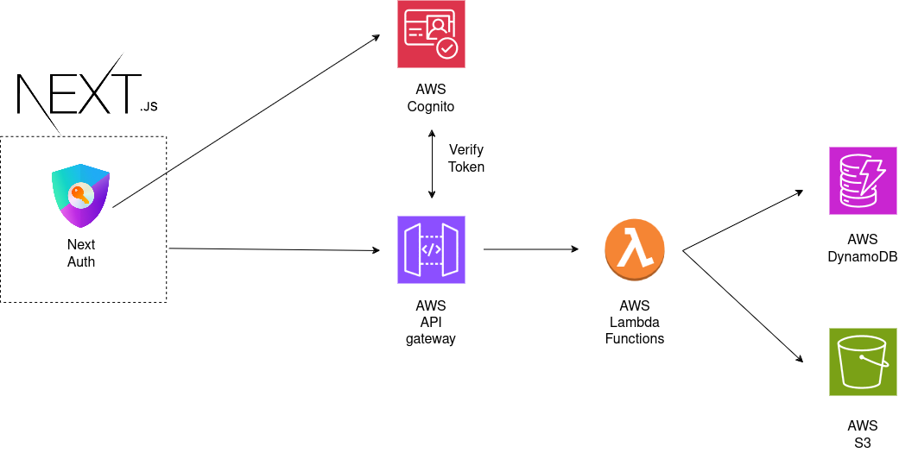

# Simple CMS

## What is Simple CMS?
Simple CMS is a straightforward Content Management System built using Amazon Web Services (AWS). It leverages AWS's flexibility and scalability to provide a powerful yet easy-to-use CMS solution.

## How to use?

Below is a simple demonstration of how to use Simple CMS.

## Key Functionalities
- **Create Post Groups:** Organize your content into distinct groups.
- **Define Schema of Post Groups:** Customize the structure and format of each Post Group.
- **Create Posts Under Post Group:** Add content that adheres to the specific schema of its group.
- **Host Files (Documents, Images):** Easily host and integrate various files into other applications.

## Technology
Curious about the technology behind Simple CMS? Here's a quick overview of the technologies involved:

The backend of Simple CMS is entirely serverless, utilizing various AWS services to ensure simplicity, flexibility, and scalability. The core components include:

- **Authentication:** AWS Cognito
- **Backend Logic:** AWS lambda
- **Database:** AWS DynamoDB
- **General Storage:** AWS S3 Bucket

All Lambda functions are coded in C# (.NET).

## Deployment
Deployment instructions will be available soon!
